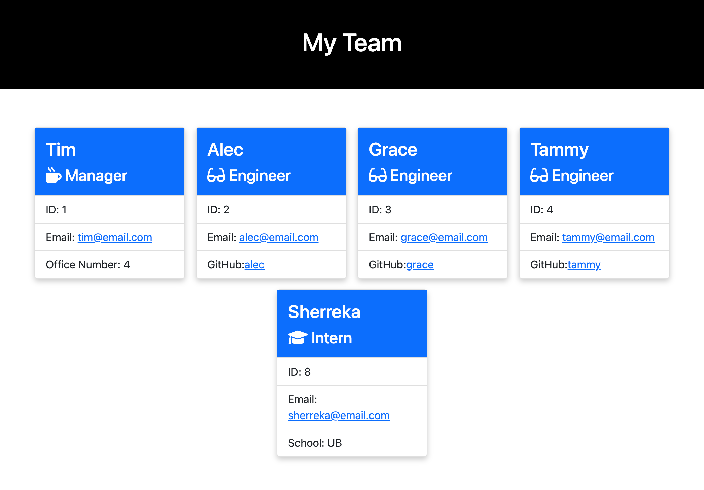

# Team Profile Generator 

## License

Please click on the badge to view license info.
   

## Description
This is a Node.js command-line application that takes in information about employees on a software engineering team, then generates an HTML webpage that displays summaries for each person. 

## Table of Contents

  - [License](#license)
  - [Description](#description)
  - [Installation](#installation)
  - [Usage](#usage)
  - [Visuals](#visuals)
  - [Tests](#tests)
  - [Contributors](#contributors)
  - [Contact](#contact)

## Installation
Please use npm install to use all the functionality of the project.

## Usage
To generate team profile information for an organization.

## Visuals

## Tests

Yes, there are jest unit tests included for this project. To run the tests, please use npm run test.

## Contributors

Sherreka S. Burton

## Contact

If you have any questions about this project please contact: Sherreka S. Burton

Github: [ssbbgm](http://github.com/ssbbgm)

Email: ssburto825@gmail.com

